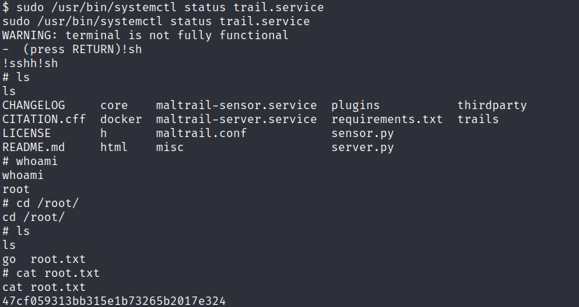

# CVE-2023-26604

## Vulnerable Version
< 247

## Info
systemctl에 SUID가 걸릴 경우만 가능 
systemctl status 명령어를 사용했을 때 보여지는 양이 너무 많아 less를 통해서 보여주는 데, 이 때 less가 root 권한으로 실행돼 command execute 시 root 권한으로 작동한다는 것이다. 
vim처럼 ![command]를 하면 된다.

### Example
